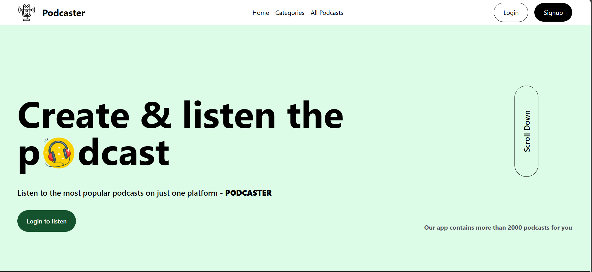
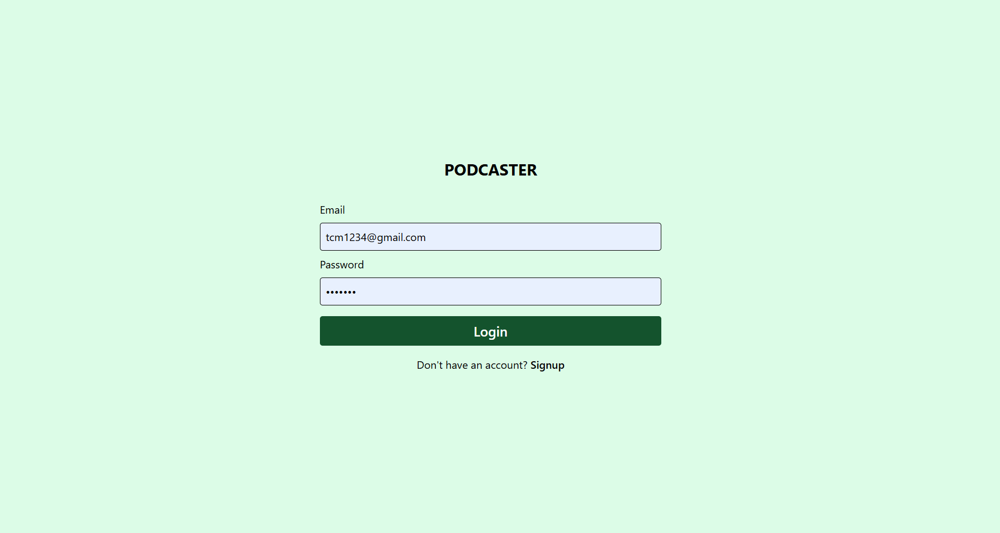
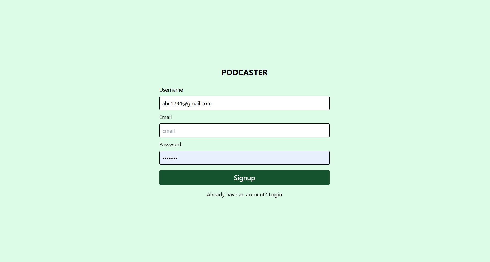
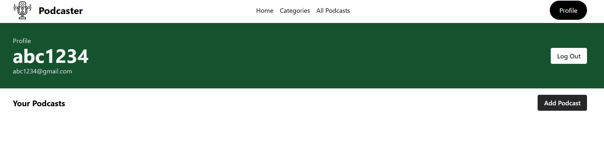
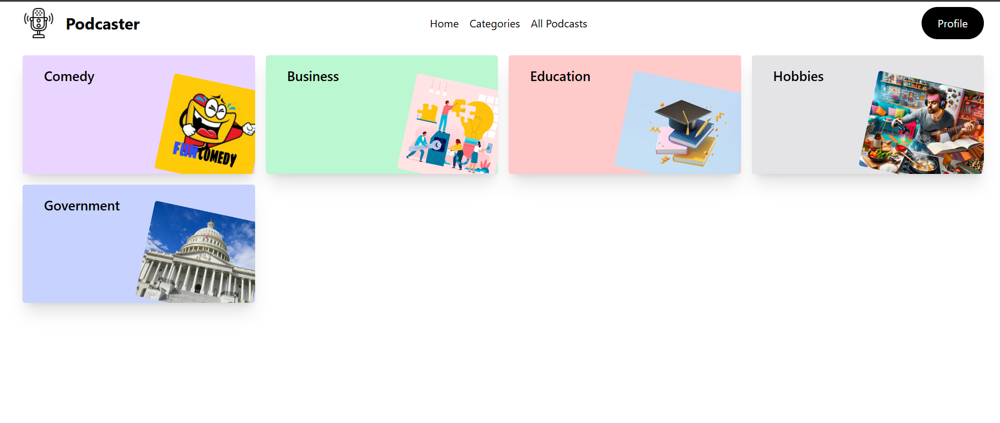
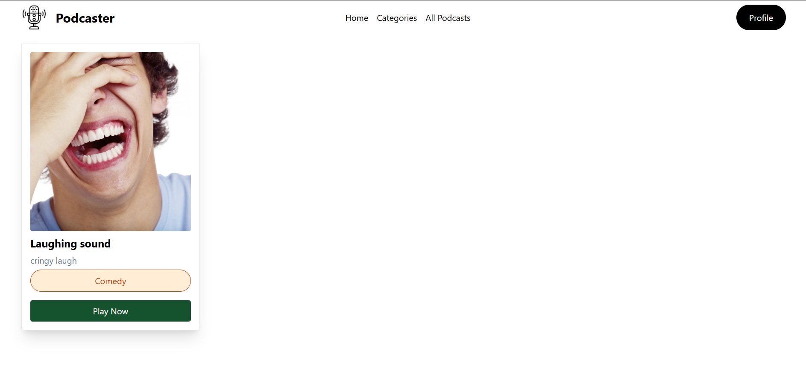
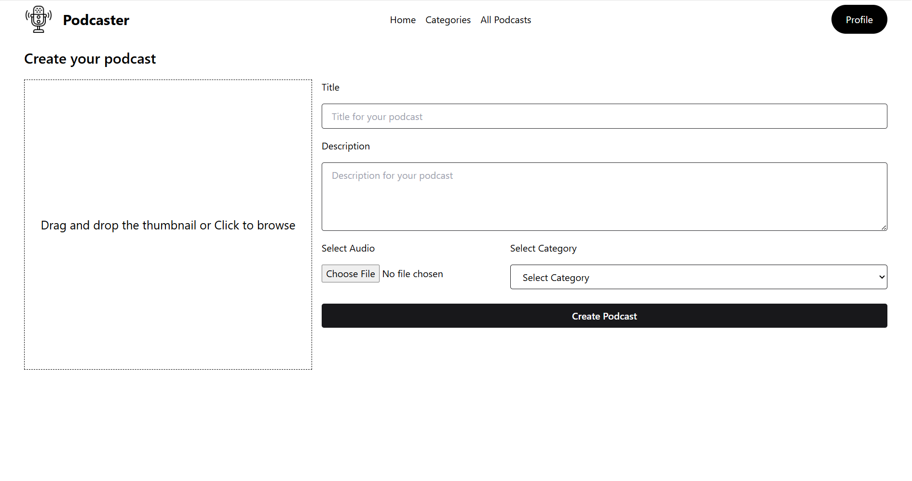
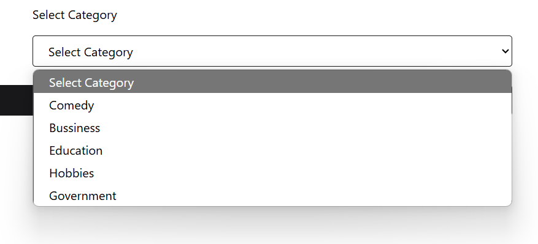

# Podcaster

## Project Overview

**Podcaster** is a podcast management and listening platform built with **React**, **Redux**, **Tailwind CSS**, and **Express.js**. It allows users to browse podcasts by category, view detailed information about specific podcasts, and manage their user profile. The backend is powered by **Node.js** with **MongoDB** for data storage, and authentication is managed through **JWT**.

## Features

- User Authentication (Login, Signup)
- Add, View, and Browse Podcasts
- View Podcasts by Category
- User Profile Management
- Podcast Player
- Protected Routes for Adding Podcasts
- Tailwind CSS for Styling
- State Management with Redux
- REST API for Backend Communication

## Screenshots

<!-- Add images for each page/component -->
### Home Page


### Login Page


### Signup Page


### Profile Page


### Categories Page


### Podcast Details Page


### Add Podcast Page


### Category Option


### Error Page (404)


## Installation

1. Clone the repository:

```bash
git clone https://github.com/Nishnat14/Podcasters.git
```

2. Navigate to the project directory:
```bash
cd podcaster
```
3. Install dependencies for the frontend:
```bash
cd frontend
npm install
```
4. Install dependencies for the backend:
```bash
Copy code
cd ../backend
npm install
```
5. Set up environment variables in the backend directory:
```bash
PORT=1000
MONGO_URI=your-mongo-uri
JWT_SECRET=your-jwt-secret
NODE_ENV=production
```
6. Start the backend server:
```bash
nodemon app.js
```
7. Start the frontend server:
```bash
cd ../frontend
npm run dev
```

## Authentication

POST /api/v1/login: Login and get JWT token
POST /api/v1/signup: Register a new user

## Podcasts

GET /api/v1/podcasts: Fetch all podcasts
POST /api/v1/podcasts: Add a new podcast (requires authentication)
GET /api/v1/podcasts/:id: Fetch a specific podcast by ID
GET /api/v1/podcasts/categories/:category: Fetch podcasts by category

## User

GET /api/v1/user/profile: Get user profile
PUT /api/v1/user/profile: Update user profile

## Technologies Used

**Frontend**: React, Redux, Axios, Tailwind CSS, React Router

**Backend**: Node.js, Express.js, MongoDB, Mongoose

**Authentication**: JSON Web Tokens (JWT)

**Styling**: Tailwind CSS
